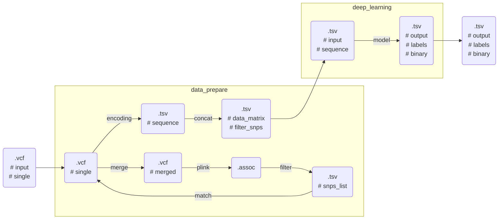

```mermaid
flowchart LR
    subgraph data_prepare
        direction LR
        A(.vcf\n# single) --> |merge| B(.vcf\n# merged)
        B(.vcf\n# merged) --> |plink| C(.assoc)
        C(.assoc) --> |filter| D(.tsv\n# snps_list)
        A(.vcf\n# single) --> |encoding| E(.tsv\n# sequence)
        D(.tsv\n# snps_list) --> |match| A(.vcf\n# single)
        E(.tsv\n# sequence) --> |concat| F(.tsv\n# data_matrix\n# filter_snps)
    end
    subgraph deep_learning
        direction LR
        G(.tsv\n# input\n# sequence) --> |model| H(.tsv\n# output\n# labels\n# binary)
    end
    I(.vcf\n# input\n# single) --> A(.vcf\n# single)
    F(.tsv\n# data_matrix\n# filter_snps) --> G(.tsv\n# input\n# sequence)
    H(.tsv\n# output\n# labels\n# binary) --> J(.tsv\n# output\n# labels\n# binary)

```